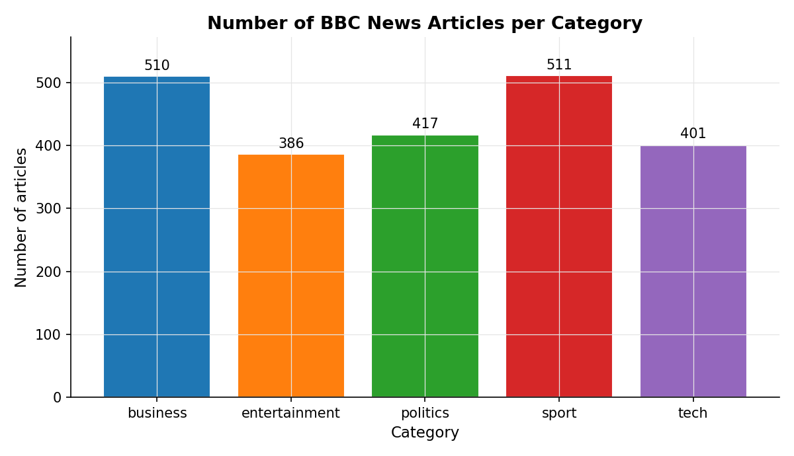
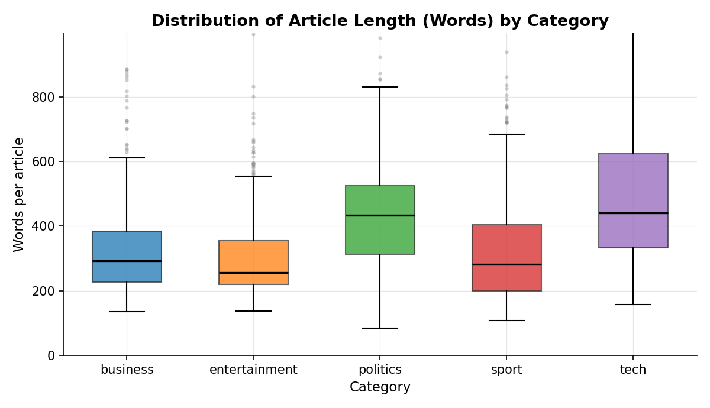
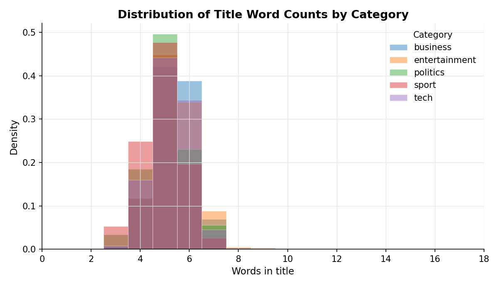
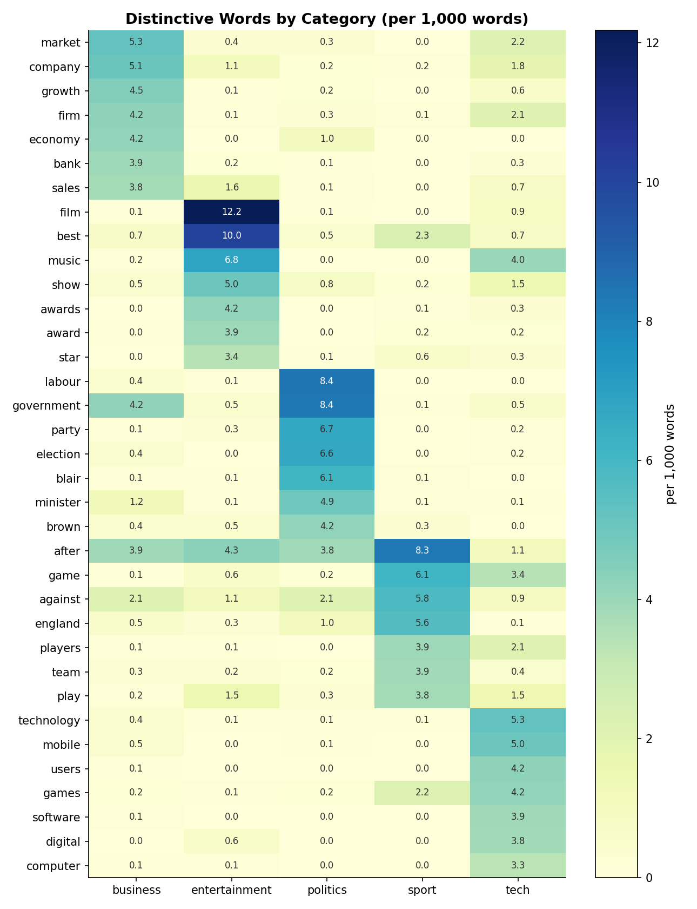

```{r setup, include=FALSE}
library(tidyverse)
library(stringr)
library(knitr)
library(scales)

# A small helper used throughout the report. It takes any data frame with a
# character column and returns its number of words (whitespace-delimited).
count_words <- function(text) {
  text |>
    stringr::str_squish() |>
    stringr::str_count("\\S+")
}

theme_set(theme_minimal(base_size = 12))
```

# Introduction {#sec-introduction}

News classification is one of the canonical problems of natural-language
processing: given a piece of text, decide whether it belongs to *business*,
*entertainment*, *politics*, *sport* or *tech*. Long before deep neural
networks made this easy, journalists, librarians and computer scientists
asked a simpler question that still motivates modern systems: **do news
articles in different categories actually look different on the surface?**

This project takes one of the most-cited public benchmarks in the area, the
**BBC News dataset** [@greene2006], and answers that question with a
strictly tidyverse workflow. Concretely, we will:

* describe the structure of the corpus (2,225 articles in five categories);
* derive new features --- length of the title, length of the body, share of
  category-specific vocabulary --- using `mutate`, `filter`, `summarise` and
  `inner_join` chained through the pipe `|>`;
* visualise the resulting patterns with three distinct `ggplot2` charts plus
  a heat-map of the most distinctive words per category;
* draw conclusions about which surface features carry the most discriminative
  power.

The deliverable is a single self-contained Quarto report, intended as a
university-level demonstration of the tidyverse workflow [@wickham2019;
@quarto2024].

# Presentation of the data {#sec-data}

The data was downloaded from Kaggle [@kaggle_bbc] and stored as a single
tab-separated file (`bbc-news-data.csv`). Each row is one news article
collected from the BBC News website between 2004 and 2005.

```{r load-data}
news <- readr::read_tsv("bbc-news-data.csv", show_col_types = FALSE)

dim(news)
glimpse(news)
```

```{r head-data}
news |>
  head(5) |>
  mutate(content = str_trunc(content, 90)) |>
  knitr::kable(caption = "First five rows of the raw BBC News data frame.")
```

The data frame contains four columns:

| Column     | Type        | Unit / domain                                                          |
|------------|-------------|------------------------------------------------------------------------|
| `category` | character   | One of `business`, `entertainment`, `politics`, `sport`, `tech`.       |
| `filename` | character   | Original BBC text-file name, e.g. `001.txt`. Identifies the article.   |
| `title`    | character   | Headline of the article (free text, English).                          |
| `content`  | character   | Full body of the article (free text, English, up to ~4,400 words).     |

To enrich the analysis we also load a small auxiliary table that we will
later `inner_join` to the articles. It groups the five categories into
broader newsroom sections.

```{r load-meta}
category_meta <- readr::read_csv("category_meta.csv", show_col_types = FALSE)
category_meta |> knitr::kable(caption = "Auxiliary table mapping each category to its broader BBC newsroom section.")
```

# Transformation of data {#sec-transformations}

We now build three derived tables. Each one exercises a different part of
the tidyverse: feature engineering, grouped aggregation and a relational
join.

## Table 1 -- Feature engineering with `mutate` and a user-defined function

We add three new columns: the number of words in the title, the number of
words in the body, and a coarse "long article" flag.

```{r table1}
news_features <- news |>
  mutate(
    title_words   = count_words(title),
    content_words = count_words(content),
    long_article  = if_else(content_words >= 500, "long", "short")
  )

news_features |>
  select(category, filename, title_words, content_words, long_article) |>
  head(8) |>
  knitr::kable(caption = "Engineered features for the first eight articles.")
```

**Reading the table.** `count_words` is our user-defined helper that uses
`str_squish` (collapses whitespace) and `str_count("\\S+")` (counts
non-whitespace runs). The `long_article` column will let us slice the
corpus by article length later on.

## Table 2 -- Grouped summary with `group_by` + `summarise`

Now we aggregate per category to get a one-row-per-category profile of the
corpus.

```{r table2}
category_summary <- news_features |>
  group_by(category) |>
  summarise(
    n_articles           = n(),
    avg_title_words      = mean(title_words)   |> round(2),
    avg_content_words    = mean(content_words) |> round(1),
    median_content_words = median(content_words),
    sd_content_words     = sd(content_words)   |> round(1),
    pct_long             = mean(long_article == "long") |> percent(accuracy = 0.1)
  ) |>
  arrange(desc(n_articles))

category_summary |>
  knitr::kable(caption = "Per-category summary statistics.")
```

**Reading the table.** *Sport* and *business* are the largest categories
(511 and 510 articles); *entertainment* is the smallest (386). Average
article length differs sharply: *politics* and *tech* articles average
~470 and ~440 words respectively, while *business* and *sport* sit closer
to ~330 and ~340. The standard deviations are largest for *politics*
(~300) --- the long-form features push the tail of the distribution far
out.

## Table 3 -- Relational join with `inner_join`

Finally we use `inner_join` to attach the broader-section labels from
`category_meta`, then re-aggregate at the section level.

```{r table3}
section_summary <- news_features |>
  inner_join(category_meta, by = "category") |>
  group_by(broad_section) |>
  summarise(
    n_articles        = n(),
    n_categories      = n_distinct(category),
    avg_content_words = mean(content_words) |> round(1),
    share_long        = mean(content_words >= 500) |> percent(accuracy = 0.1)
  ) |>
  arrange(desc(n_articles))

section_summary |>
  knitr::kable(caption = "Articles aggregated to the broader newsroom-section level.")
```

**Reading the table.** Once we collapse *business* + *politics* into the
"hard news" section it becomes the largest block of the corpus (927
articles). The "technology" desk has the highest share of long pieces
(~38 %), reflecting feature-style writing about gadgets, software and the
internet. "Sports" remains short and punchy: only ~15 % of articles
reach 500 words.

# Exploratory data analysis {#sec-eda}

## Plot 1 -- Bar chart: corpus composition

```{r plot1, eval=FALSE}
news_features |>
  count(category) |>
  ggplot(aes(x = fct_reorder(category, n, .desc = TRUE), y = n, fill = category)) +
  geom_col(width = 0.65) +
  geom_text(aes(label = n), vjust = -0.4, size = 3.6) +
  labs(
    title = "Number of BBC News articles per category",
    x = "Category", y = "Number of articles"
  ) +
  theme(legend.position = "none")
```



The five classes are reasonably balanced --- the largest (*sport*, 511) is
only ~32 % bigger than the smallest (*entertainment*, 386). A trained
classifier will not need much resampling; the chart also tells us the
prior probability the BBC editorial team itself assigned to each beat over
the period covered.

## Plot 2 -- Boxplot: how long is the body of an article?

```{r plot2, eval=FALSE}
news_features |>
  ggplot(aes(x = category, y = content_words, fill = category)) +
  geom_boxplot(alpha = 0.75, outlier.alpha = 0.25, width = 0.55) +
  coord_cartesian(ylim = c(0, 1000)) +
  labs(
    title = "Distribution of article length (words) by category",
    x = "Category", y = "Words per article"
  ) +
  theme(legend.position = "none")
```



The boxplot makes clear that *politics* and *tech* are the long-form beats:
the median politics piece is 434 words, almost 50 % longer than the median
business piece (292). *Sport* is the shortest and the most concentrated.
*Entertainment* has a long tail of unusually long features --- profile
pieces of musicians, film reviews, awards round-ups.

## Plot 3 -- Histogram: title length distribution

```{r plot3, eval=FALSE}
news_features |>
  ggplot(aes(x = title_words, fill = category)) +
  geom_histogram(binwidth = 1, position = "identity",
                 alpha = 0.45, colour = "white") +
  scale_x_continuous(limits = c(0, 18)) +
  labs(
    title = "Distribution of title word counts by category",
    x = "Words in title", y = "Count"
  )
```



Headlines, in stark contrast to bodies, are remarkably uniform across
categories: the mode is 5 words for every category, almost no headline
exceeds 12 words, and the densities essentially overlay one another.
Headline length is therefore *not* a useful feature for classification ---
a good reminder that visible style differences sit in the body of the
piece, not in its packaging.

## Plot 4 -- Heatmap: distinctive vocabulary per category

```{r plot4, eval=FALSE}
# A second user-defined helper: turn raw text into a tidy bag-of-words.
tokenise <- function(txt) {
  txt |>
    str_to_lower() |>
    str_extract_all("[a-z]{4,}") |>
    unlist()
}

stop_words <- c("said","also","year","years","first","last","told","more","most",
                "after","before","there","their","they","them","this","that",
                "these","those","with","from","into","about","over","when",
                "what","which","were","been","have","has","had","its","our",
                "are","not","but","you","your","could","would","should",
                "than","then","one","two","very","much","many","such","new")

tokens <- news_features |>
  select(category, content) |>
  mutate(token = map(content, tokenise)) |>
  select(-content) |>
  unnest(token) |>
  filter(!token %in% stop_words)

per_cat_freq <- tokens |>
  group_by(category, token) |>
  summarise(n = n(), .groups = "drop") |>
  group_by(category) |>
  mutate(per_1000 = n / sum(n) * 1000) |>
  ungroup()

# Keep words that are highly concentrated in a single category.
global_freq <- per_cat_freq |>
  group_by(token) |>
  summarise(global_per_1000 = sum(n) / sum(per_cat_freq$n) * 1000)

distinctive <- per_cat_freq |>
  inner_join(global_freq, by = "token") |>
  mutate(lift = per_1000 / global_per_1000) |>
  filter(n >= 60, lift >= 2) |>           # frequent in this category and disproportionately so
  group_by(category) |>
  slice_max(per_1000, n = 7, with_ties = FALSE) |>
  ungroup()

distinctive |>
  ggplot(aes(x = category, y = fct_reorder(token, per_1000), fill = per_1000)) +
  geom_tile(colour = "white") +
  geom_text(aes(label = round(per_1000, 1)), size = 3) +
  scale_fill_distiller(palette = "YlGnBu", direction = 1) +
  labs(
    title = "Distinctive words by category (per 1,000 words)",
    x = "Category", y = NULL, fill = "per 1,000 words"
  )
```



This is the most informative visualisation in the report. The bright
diagonal blocks tell us the model's job will be relatively easy:

* *Business* is dominated by **market, company, growth, firm, economy, bank, sales**.
* *Entertainment* is dominated by **film, best, music, show, awards, award, star**.
* *Politics* is dominated by **labour, government, party, election, blair, minister, brown**.
* *Sport* is dominated by **game, against, england, players, team, play**.
* *Tech* is dominated by **technology, mobile, users, games, software, digital, computer**.

Crucially, almost no word from one category appears in the top-7
distinctive list of another category. This is empirical confirmation that
**lexical features alone** carry most of the classification signal in this
dataset --- which is why simple TF-IDF + linear SVM models routinely score
above 95 % accuracy on it.

# Interpretation and conclusion {#sec-conclusion}

Three findings stand out from the analysis.

The first is that **the corpus is well balanced**. Each of the five
categories contributes between 17 % and 23 % of the total 2,225 articles,
so a classifier trained on this corpus does not have to fight a strong
class-prior bias.

The second is that **the body of the article carries the discriminative
signal**. Politics and tech pieces are roughly 50 % longer than business
or sport pieces, and the per-category vocabulary is sharply distinct
(Plot 4). On the other hand, **headline length is essentially identical
across categories** (Plot 3) --- a surprising but consistent pattern that
reflects house style rather than content.

The third is more methodological: the entire pipeline --- from raw
tab-separated file to a publication-ready report --- fits comfortably in a
single tidyverse chain of `read_tsv |> mutate |> group_by |> summarise |>
inner_join |> ggplot`. The pipe operator `|>` is what makes the analysis
read like a sentence rather than a stack of nested function calls, and is
the workflow this assignment was designed to demonstrate.

A natural extension would be to compute TF-IDF weights and project the
articles into 2-D with `irlba::prcomp_irlba` plus `ggplot2`; we would
expect to see five well-separated clusters, in line with the lexical
fingerprints uncovered above.

# References {#sec-references}

::: {#refs}
:::

```{=html}
<div class="references">
<p><strong>Dataset.</strong> BBC News dataset, Kaggle:
<a href="https://www.kaggle.com/datasets/pariza/bbc-news-summary">https://www.kaggle.com/datasets/pariza/bbc-news-summary</a>
(originally released by Greene &amp; Cunningham, 2006).</p>

<p><strong>Greene, D. and Cunningham, P. (2006).</strong> "Practical Solutions to the Problem of Diagonal Dominance in Kernel Document Clustering". <em>Proceedings of ICML 2006</em>.
<a href="http://mlg.ucd.ie/datasets/bbc.html">http://mlg.ucd.ie/datasets/bbc.html</a></p>

<p><strong>Wickham, H. et al. (2019).</strong> "Welcome to the tidyverse". <em>Journal of Open Source Software</em>, 4(43), 1686.
<a href="https://doi.org/10.21105/joss.01686">https://doi.org/10.21105/joss.01686</a></p>

<p><strong>Quarto Project Authors (2024).</strong> Quarto: An open-source scientific and technical publishing system.
<a href="https://quarto.org">https://quarto.org</a></p>

<p><strong>Wikipedia contributors.</strong> "Exploratory data analysis", Wikipedia, The Free Encyclopedia.
<a href="https://en.wikipedia.org/wiki/Exploratory_data_analysis">https://en.wikipedia.org/wiki/Exploratory_data_analysis</a> (consulted May 2026).</p>
</div>
```
